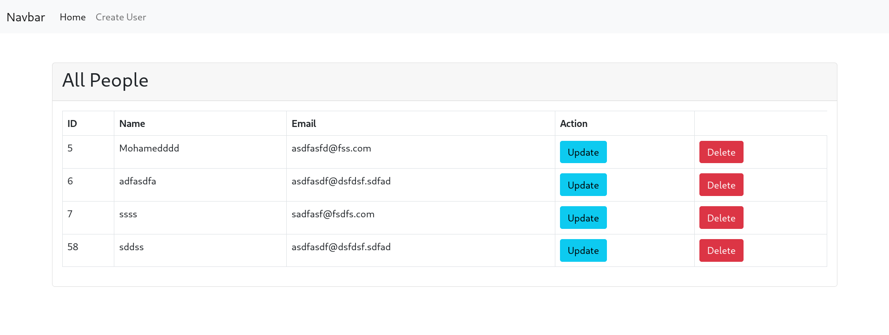
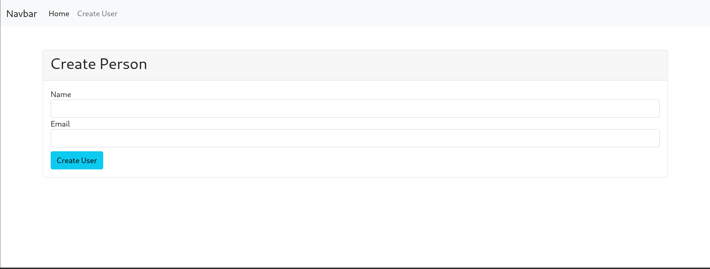
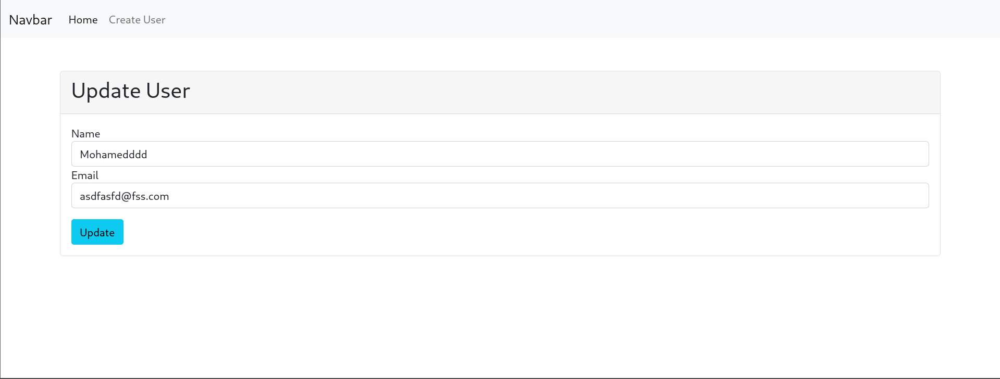
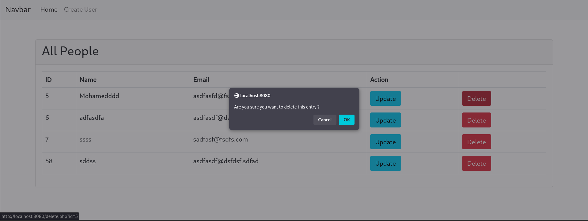

# PHP OOP CRUD App — Dockerized

A simple, fully containerized **PHP + PDO + MySQL** CRUD application for managing people records (Create, Read, Update, Delete), built as part of a Web Pentest / OOP PHP learning track.

---

## 🛠️ Tech Stack

| Technology | Purpose |
|---|---|
|  | Server-side logic (PDO for DB access) |
|  | Relational database |
|  | Containerization & orchestration |
|  | Web server (via official `php:8.2-apache` image) |
|  | Front-end styling |
|  | Database administration UI |

---

## ✨ Features

- Full CRUD (Create, Read, Update, Delete) for `people` records (name + email)
- PDO with prepared statements to prevent SQL injection
- Environment-variable-based DB configuration (no hardcoded credentials in code)
- Client-side delete confirmation dialog
- Auto-provisioned database and seed data on first run (`init.sql`)
- One-command setup with Docker Compose (app + database + phpMyAdmin)

---

## 📸 Screenshots

**Home page — list of all people**


**Create a new person**


**Update an existing person**


**Delete confirmation dialog**


---

## 🚀 Getting Started

### Prerequisites
- [Docker](https://www.docker.com/) and Docker Compose installed

### Run the project

```bash
# 1. Clone the repository
git clone https://github.com/0xElghobashy/php-oop-docker-crud.git
cd php-oop-docker-crud

# 2. Build and start the containers
docker compose up --build
```

### Access the app

| Service | URL | Credentials |
|---|---|---|
| Web App | http://localhost:8080 | — |
| phpMyAdmin | http://localhost:8081 | user: `root` / password: `root_password` |

The `people` table and sample rows are created automatically on first run via `init.sql`.

---

## 📁 Project Structure

```
.
├── Dockerfile              # PHP 8.2 + Apache image with pdo_mysql extension
├── docker-compose.yml      # app, MySQL, and phpMyAdmin services
├── init.sql                # creates the `people` table and seeds sample data
├── db.php                  # DB connection (host/name/user/password via env vars)
├── index.php                # list all people
├── create.php               # create a new person
├── edit.php                 # update an existing person
├── delete.php                # delete a person
├── header.php / footer.php   # shared layout (Bootstrap 5)
└── screenshots/              # README preview images
```
---

## 🐛 Troubleshooting

### Container name conflict on `docker compose up --build`

**Error:**

```text
Error response from daemon: Conflict. The container name "/mysql_db" is already in use by container "...".
You have to remove (or rename) that container to be able to reuse that name.
```

**Cause:**

A container with the same name (`mysql_db`, `php_app`, or `phpmyadmin`) already exists from a previous run of this project (or another clone of it) on your machine. Docker Compose doesn't allow two containers to share the same name.

**Fix:**

Remove the old container(s), then rebuild:

```bash
docker rm -f mysql_db php_app phpmyadmin
docker compose up --build
```

If you also want to wipe the old database data and start completely fresh:

```bash
docker compose down -v
docker compose up --build
```
